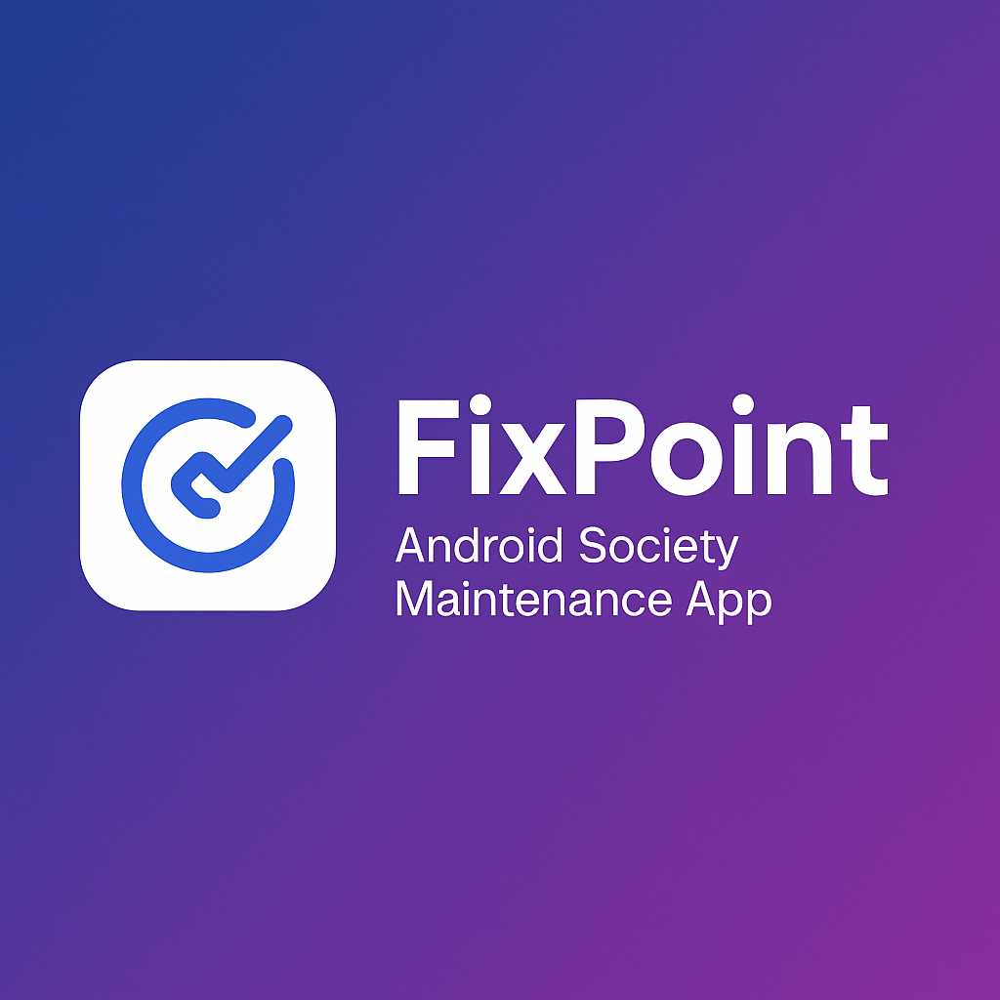
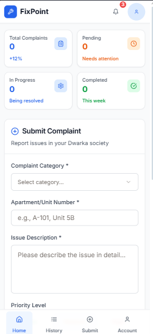

# FixPoint 🛠️

**FixPoint** is an Android-first app built to help residential societies manage small repairs and complaints in a cleaner, more reliable way.  
Residents can easily raise issues, and admins or repair workers can track, prioritize, and close them — without endless back-and-forth on WhatsApp or confusion about what’s pending.

This was something I imagined after noticing how society maintenance often works: unclear, slow, and messy. I wanted to see if I could build a system that makes it just a bit smoother and more transparent.

---

## 📱 Features

- 📝 Submit complaints through a simple, clean form  
- ⏳ Track status (Pending / In Progress / Done) — no more wondering what’s happening  
- 🧑‍💼 Admin view for repair workers and society managers  
- 📱 Mobile-first layout, especially optimized for Android  
- ✨ Clean, easy-to-understand UI for all age groups — no tech skills needed

---

## 🔗 Live Preview

Try out FixPoint here on Replit:  
👉 [FixPoint on Replit](https://replit.com/@kushagragoel40/Fixpoint?v=1)

---

## 🚧 What I’m Planning to Add Next

These are features I’d really like to include based on how people actually interact with these kinds of systems:

- 📷 Upload images with complaints (because a picture says more than text sometimes)  
- 👥 Login system to separate residents and admins  
- 📊 Admin dashboard with sorting, filters, and better control  
- 🔔 Optional push notifications or reminders  
- ⭐ Worker ratings to help choose the most trusted people — and maybe reward good work

---

## 🌱 What I Learned

This was more than just a coding exercise — it was my first real attempt at turning an idea into something I could actually use, show, and build on.

I learned:

- How to build with **React** and organize components clearly  
- How to design clean, mobile-first interfaces using **Tailwind CSS**  
- The importance of thinking from the **user’s perspective**, not just the developer’s  
- How even a basic working version of something is better than a perfect idea stuck in your head  
- And honestly, how good it feels to hit "publish" on something I made myself

This was also my first time putting my work **publicly** on GitHub — which was scary at first, but I wanted to leave a mark that says:  
> _"I started building early, and this is where it began."_

---

## 👤 About Me

Hi! I’m **Kushagra Goel** — I’m 16, from India, and I like building things that feel useful.  
FixPoint is my first public project, and it’s special to me because it represents not just code, but the moment I started taking all this seriously.

---

## 🖼️ Cover Image

---
## 🖼️ Preview of the App

Here’s a quick look at what FixPoint looks like on a mobile device:

*(You can also try it live at the link above.)*

## 🧩 Issues & Roadmap

Check the [Issues tab](../../issues) for things I’m working on, or ideas I’ve noted down.  
You’ll also find little things I want to fix, add, or improve later.

---

## 💡 A Note

This project isn’t perfect — but it’s real.  
And if you're seeing this sometime in the future: I hope this reminds you (and me) that starting early, building small, and putting yourself out there is always worth it.

Thanks for checking out FixPoint 🧡
